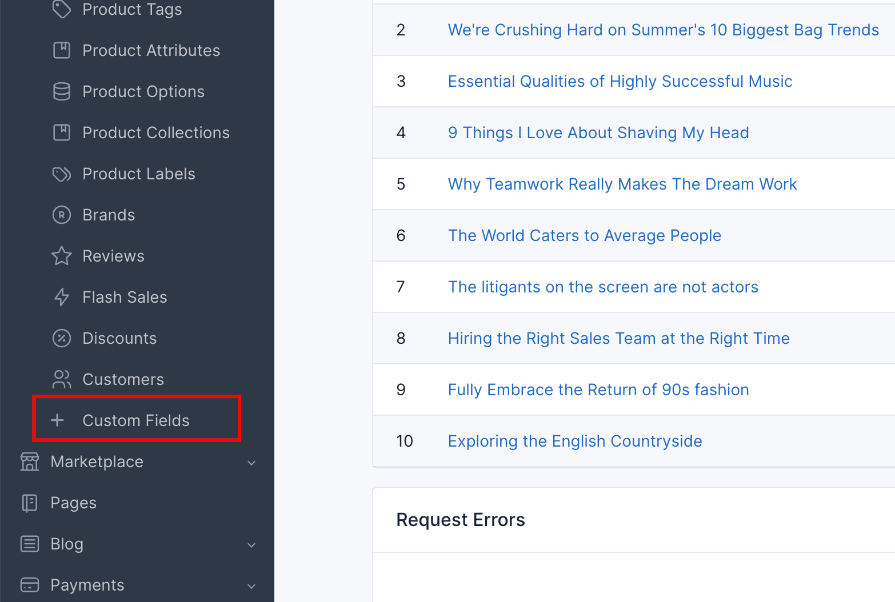
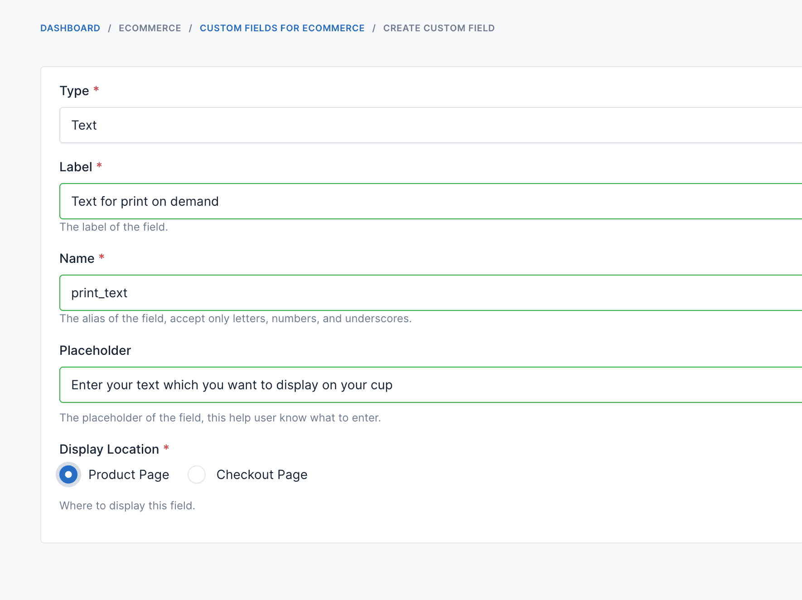
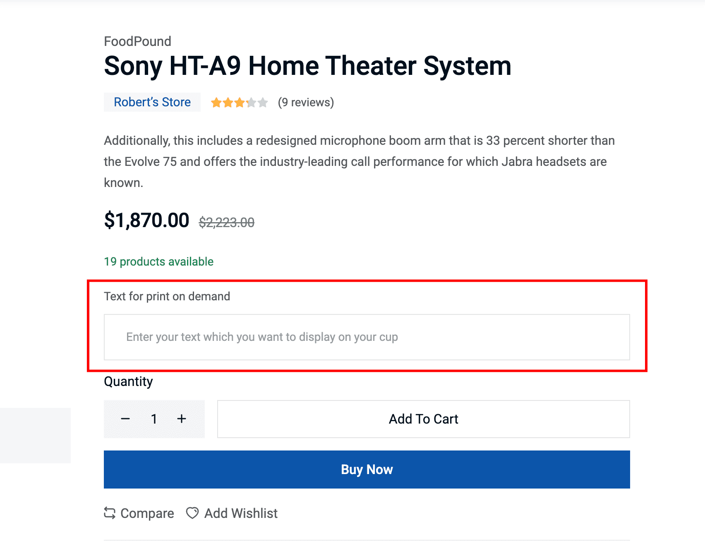
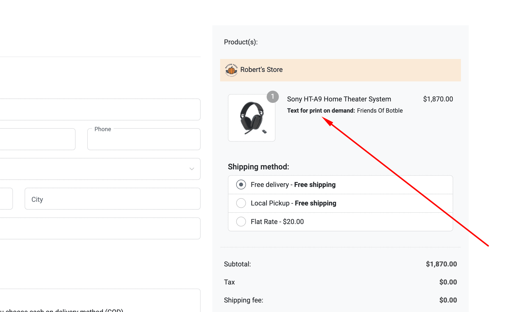
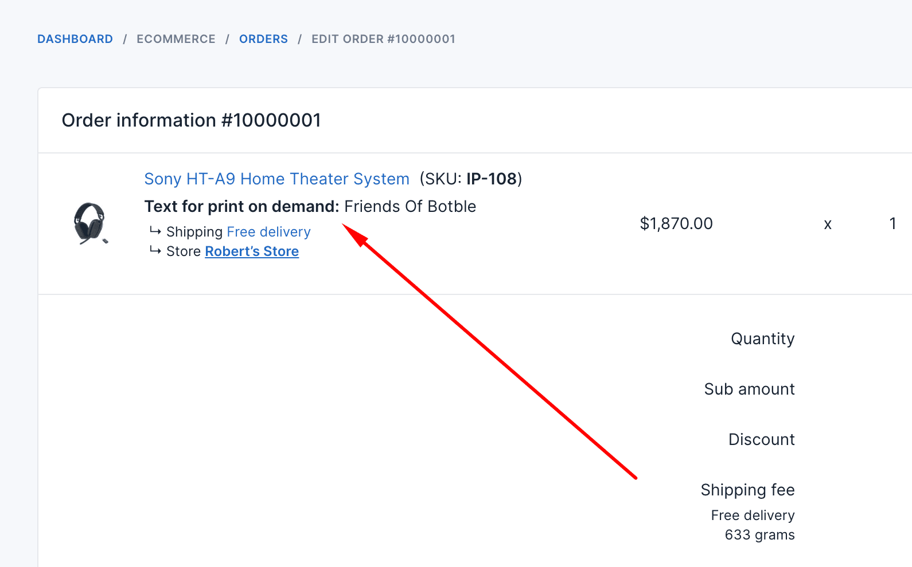
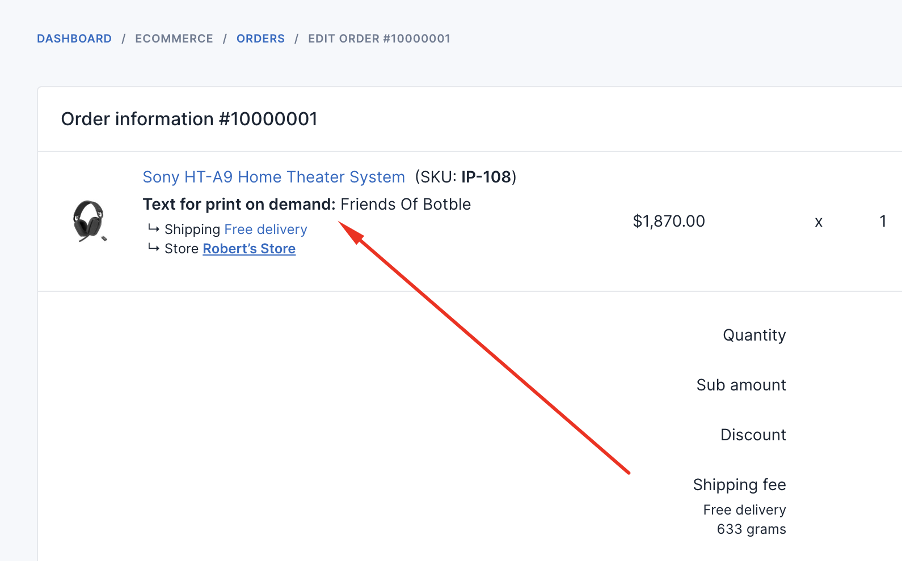
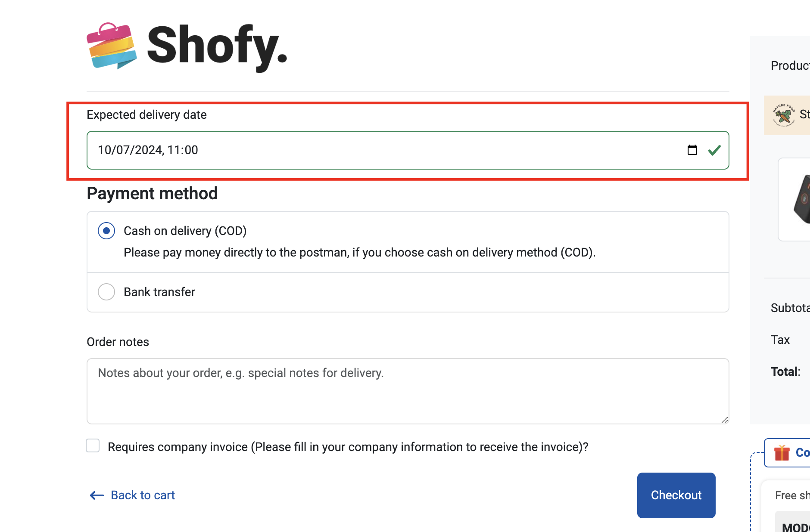
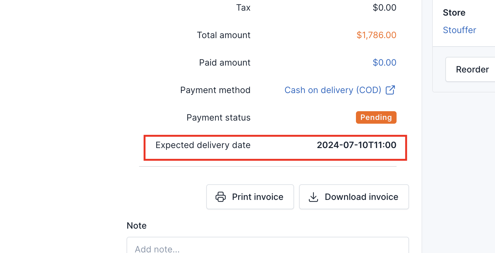

# FOB Custom Fields for eCommerce

This plugin helps you to create custom fields in product details or checkout page for ecommerce on your website.

### Demo for product detail fields

### Demo for checkout fields

## Requirements

-   Botble core 7.3.0 or higher.

## Installation

### Install via Admin Panel

Go to the **Admin Panel** and click on the **Plugins** tab. Click on the "Add new" button, find the **Custom Fields for eCommerce** plugin and click on the "Install" button.

### Install manually

1. Download the plugin from the [Botble Marketplace](https://marketplace.botble.com/products/friendsofbotble/fob-ecommerce-custom-field).
2. Extract the downloaded file and upload the extracted folder to the `platform/plugins` directory.
3. Go to **Admin** > **Plugins** and click on the **Activate** button.

## Changelog

Please see [CHANGELOG](CHANGELOG.md) for more information what has changed recently.

## Contributing

Please see [CONTRIBUTING](CONTRIBUTING.md) for details.

## Security

If you discover any security related issues, please email friendsofbotble@gmail.com instead of using the issue tracker.

## Credits

-   [Friends Of Botble](https://github.com/FriendsOfBotble)
-   [All Contributors](../../contributors)

## License

The MIT License (MIT). Please see [License File](LICENSE) for more information.
